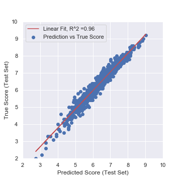

# IMDB User Score Prediction
Author: David S. White
 
Contact: dswhite2012@gmail.com

## Goal 
The goal of this project was to build a model to predict IMDB user scores. In a broader scheme, this project allowed me to learn common data science libraries in Python (e.g. Pandas, scikit-learn).

## Data Acquisition
Data was obtained using imdb_scrape.ipynb, which using Beautiful Soup to grab information from the top movies of each year. The data set contains over > 9500 films released within the past 50 years. 

## Data Cleaning
 The data were first split into a training and test set (80%/20%). Most features extracted from IMDB required little cleaning; however, "genre" (e.g. horror, action, drama), "rating" (PG, PG-13, R), and "release year" are categorical variables that needed to be encoded using a one-hot encoding scheme. As raw genre categories featured 20 unique labels, labels that were redundant  or highly correlated with other labels were removed from the analysis to reduce the number of features in the model. Release years were also grouped into decades to reduce features.

## Results
Scikit-learn was used to build and test different models. I tried a variety of models, including Linear Regression, Decision Tree, Support Vector Machine, and Random Forest. The Random Forest model was the best performing on the training set with a prediction error of ± 0.213. Metascore, genre, and the number of user votes were the strongest predictors of IMDB user scores, whereas the year released, the rating, or the run-time were relatively weak predictors.

When the model was applied to the test set, there was a prediction error of 0.204 and R2 = 0.96. 

## Next Steps
Moving forward to improve the IMDB prediction model, I think there are two more features that would be interesting to investigate: Film Budget and World-Wide Gross Profit. To obtain this data, my web-scraping script would need to visit each movies page individually. 
